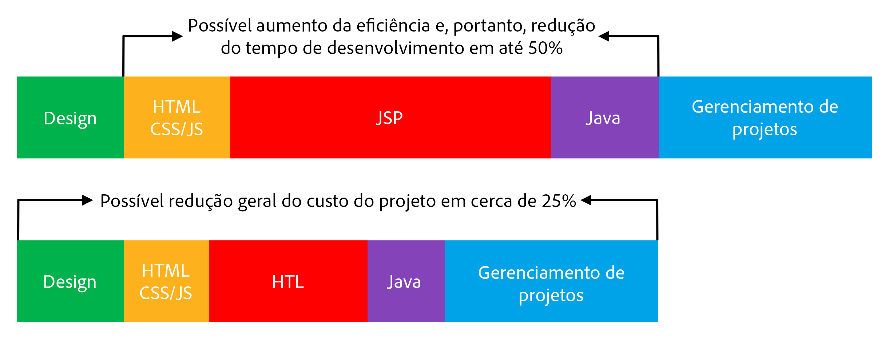

# Visão geral {#overview}

A finalidade da Linguagem de modelo HTML (HTL), suportada pelo Adobe Experience Manager (AEM), é oferecer uma estrutura da Web altamente produtiva em nível corporativo que aumenta a segurança e permite que desenvolvedores de HTML sem conhecimento Java participem melhor em projetos do AEM.

The HTML Template Language has been introduced with AEM 6.0, and takes the place of JSP (JavaServer Pages) as the preferred and recommended server-side template system for HTML. For web developers who need to build robust enterprise websites, the HTML Template Language helps to achieve increased security and development efficiency.

## Increased Security {#increased-security}

The HTML Template Language increases the security of sites that use it in their implementation, as compared to JSP and to most other template systems, because HTL is capable of automatically applying the proper context-aware escaping to all variables being output to the presentation layer. O HTL torna isso possível porque entende a sintaxe HTML e usa esse conhecimento para ajustar o escape necessário para expressões, com base em sua posição na marcação. This will for instance result in expressions placed in  or  attributes to be escaped differently from expressions placed in other attributes, or elsewhere.`href``src`

Embora o mesmo resultado possa ser obtido com linguagens de modelo como o JSP, o desenvolvedor deve garantir manualmente que o escape adequado seja aplicado a cada variável. As a single omission or mistake on the applied escaping is potentially sufficient to cause a cross-site scripting (XSS) vulnerability, we decided to automate this task with HTL. Se necessário, os desenvolvedores ainda podem especificar uma fuga diferente nas expressões, mas com HTL, o comportamento padrão é muito mais provável de corresponder ao comportamento desejado, reduzindo a probabilidade de erros.

## Simplified Development {#simplified-development}

The HTML Template Language is easy to learn and its features are purposely limited to ensure that it stays simple and straight-forward. Também tem mecanismos poderosos para estruturar a marcação e invocar a lógica, ao mesmo tempo que impõe sempre a separação rigorosa das preocupações entre marcação e lógica. O próprio HTL é HTML5 padrão, pois usa expressões e atributos de dados para anotar a marcação com o comportamento dinâmico desejado, o que significa que ela não quebra a validade da marcação e a mantém legível. Observe que a avaliação das expressões e dos atributos de dados é feita inteiramente no lado do servidor e não estará visível no lado do cliente, onde qualquer estrutura JavaScript desejada pode ser usada sem interferir.

These capabilities allow HTML developers without Java knowledge and with little product-specific knowledge to be able to edit HTL templates, allowing them to be part of the development team, and streamlining the collaboration with the full-stack Java developers. E vice-versa isso permite que os desenvolvedores Java se concentrem no código back-end sem se preocupar com HTML.

## Reduced Costs {#reduced-costs}

Maior segurança, desenvolvimento simplificado e melhor colaboração entre equipes, traduz-se para projetos AEM em menor esforço, tempo de entrada no mercado (TTM) mais rápido e menor custo total de propriedade (TCO).

Concretamente, a partir do que foi observado ao reimplementar o site Adobe.com com com a Linguagem de modelo HTML, o custo e a duração do projeto podem ser reduzidos em cerca de 25%.

O diagrama acima mostra as seguintes melhorias na eficiência potencialmente possíveis pelo HTL:

* **** HTML / CSS / JS: Como os desenvolvedores de HTML são capazes de editar diretamente modelos HTL, os designs front-end não precisam mais ser implementados separadamente do projeto AEM, mas podem ser implementados diretamente nos componentes reais do AEM. Isso reduz iterações dolorosas com desenvolvedores Java completos.
* **** JSP / HTL: Como o próprio HTL não requer conhecimento Java e é direto para escrever, qualquer desenvolvedor com conhecimento em HTML tem poder para editar os modelos.
* **** Java: Graças à API de uso clara e simples fornecida pela HTL, a interface com a lógica comercial é esclarecida, o que também beneficia o desenvolvimento do Java em geral.

**Leia a seguir:**

* [Introdução à linguagem de modelo HTML](getting-started.md)

